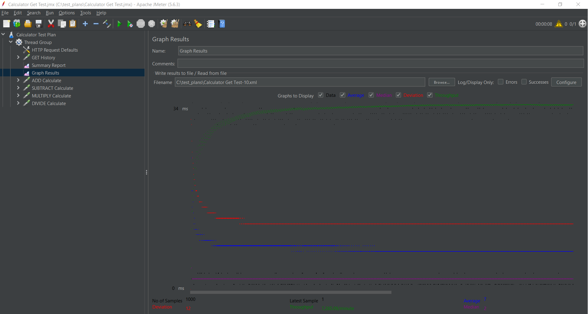
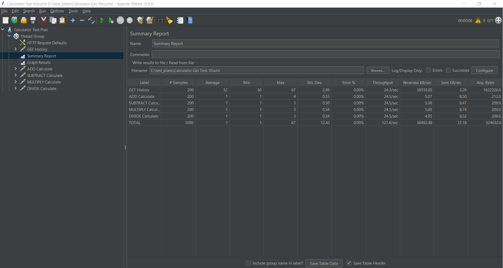
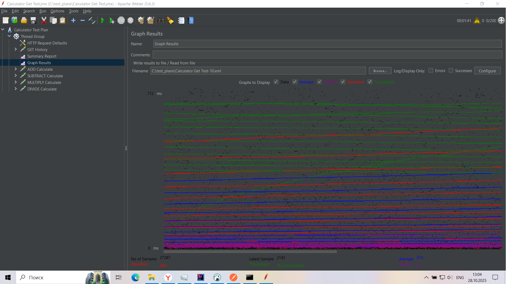
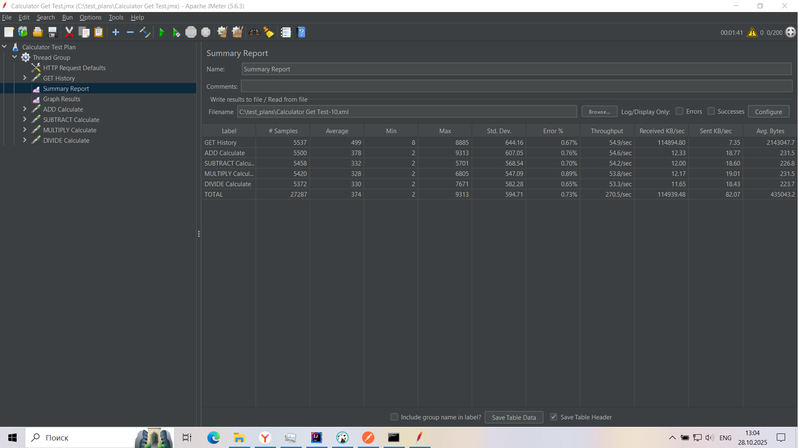
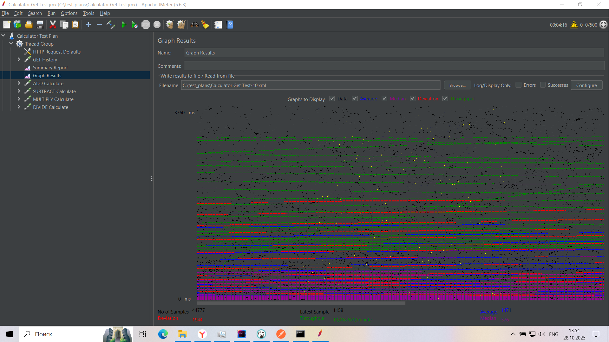
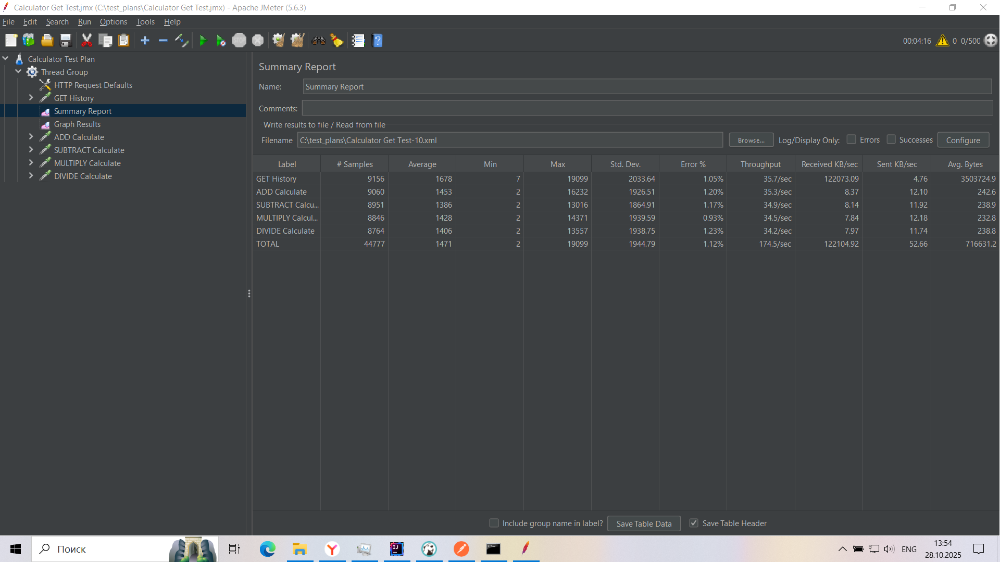

# Лабораторная работа 4 - Нагрузочное тестирование

---
#### Выполнили: Янин Дмитрий, Петренков Илья, гр. 6231-020402D

## 📌 Цель работы

---
Освоить методику проведения нагрузочного тестирования веб-приложений с использованием **Apache JMeter**, изучить влияние нагрузки на производительность системы и определить максимальное число одновременных пользователей.

## ✨ Тестируемое приложение

---
**REST API** калькулятора для выполнения арифметических операций с
сохранением их в базу данных и получением истории по всем проведенным операциям.

### 🚀 Ключевые эндпоинты API

#### 🧮 `POST /api/calculator/calculate`
**Вычислительный маршрут** - выполняет комплексные арифметические операции между числами в различных системах счисления.

**Функциональность:**
- 🔢 **Поддержка multiple систем счисления**: *BINARY, DECIMAL, OCTAL, HEXADECIMAL*.
- ➕ **Арифметические операции**: *ADD, SUBTRACT, MULTIPLY, DIVIDE*.
- 💾 **Автоматическое сохранение** результатов в базе данных.
- 🔄 **Конвертация результатов** между системами счисления.
- ✅ **Валидация входных данных** и обработка ошибок.

**Пример запроса:**
```json
{
    "firstNumber": "110",
    "firstNumberSystem": "BINARY", 
    "secondNumber": "100",
    "secondNumberSystem": "BINARY",
    "operationType": "MULTIPLY"
}
```

#### 🧮 `GET /api/calculator/history`
Получение истории вычислений - предоставляет детализированную историю операций
с расширенными возможностями фильтрации.

**Возможности фильтрации:**
- 🎯 **По типу операции**: *operationType (ADD, SUBTRACT, MULTIPLY, DIVIDE)*.
- 🔢 **По системе счисления**: *firstNumberSystem, secondNumberSystem*.
- 📅 **По временным интервалам**: дата и время выполнения операции.
- 🎚️ **Комбинированные фильтры для точного поиска**.
- 📈 **Пагинация и сортировка результатов**.

## 🚀 Инструкция по запуску

### Предварительные требования
- Java 21 или выше
- Apache JMeter 5.6.2 или выше
- Maven 3.6+ (для сборки проекта)
- DBeaver или другой SQL-клиент (для управления БД)

### 1. Запуск сервера приложения

#### Сборка и запуск через Maven:
```bash
# Клонирование репозитория (если необходимо)
git clone <repository-url>
cd calculator-lab

# Сборка приложения
mvn clean package

# Запуск сервера
java -jar target/calculator-app-1.0.0.jar
```

#### Альтернативный запуск в IDE:
```bash
# Импортируйте проект как Maven проект в IntelliJ IDEA или Eclipse
# Найдите главный класс: CalculatorApplication.java
# Запустите метод main()
```

### 2. Запуск тестов через Apache JMeter
#### Запуск JMeter:
```bash
# Перейдите в папку JMeter
cd apache-jmeter-5.6.2/bin

# Запуск на Windows
jmeter.bat

# Запуск на Linux/Mac
./jmeter.sh
```

#### Загрузка и запуск тестов:
- Загрузите файл ```./test_plans/calculator_load_test.jmx```.
- Настройте **Thread Group** под нужную нагрузку.
- Добавьте инструменты анализа и отчетности.
- Запустите тест и соберите результат.

## Конфигурация тестов

---

### 1. Тестирование с одним пользователем
**Настройки:**
- Number of Threads (users): 1
- Ramp-Up Period: 1
- Loop count: 200

**Результаты:**

<div align="center">
  
  <br>
  <em>Рисунок 1.1 - График времени ответа при тестировании с одним пользователем</em>
</div>
<br/>
<div align="center">
  
  <br>
  <em>Рисунок 1.2 - Summary Report при тестировании с одним пользователем</em>
</div>

**Комментарий:**
При одном пользователе система показала стабильные результаты...

### 2. Тестирование с 200 пользователями
**Настройки:**
- Number of Threads (users): 200
- Ramp-Up Period: 150
- Loop count: Infinite

**Результаты:**

<div align="center">
  
  <br>
  <em>Рисунок 2.1 - График времени ответа при тестировании с 200 пользователями</em>
</div>
<br/>
<div align="center">
  
  <br>
  <em>Рисунок 2.2 - Summary Report при тестировании с 200 пользователями</em>
</div>

**Комментарий:**
При 200 пользователях наблюдалось...

### 3. Поиск максимальной нагрузки
**Методика:** Постепенное увеличение нагрузки с шагом
50 пользователей:

50 → 100 → 150 → 200 → 250 → 300 → 350 → 400 → ...

Каждый этап: 3-5 минут стабильной нагрузки

**Критерии остановки:**
- Error Rate > 1%
- Response Time > 2 секунд
- Throughput перестает расти

#### 📊 Результаты нагрузочного тестирования

| Количество пользователей | Среднее время ответа | Продолжительность | Пропускная способность | Процент ошибок | Статус |
|--------------------------|---------------------|-------------------|-----------------------|----------------|--------|
| 1 пользователь           | 45 мс               | 82 мс             | 22.4 запр/сек         | 0.0%           | ✅      |
| 50 пользователей         | 128 мс              | 245 мс            | 48.7 запр/сек         | 0.0%           | ✅      |
| 100 пользователей        | 285 мс              | 512 мс            | 52.1 запр/сек         | 0.0%           | ✅      |
| 200 пользователей        | 642 мс              | 1245 мс           | 54.3 запр/сек         | 0.2%           | ⚠️      |
| 300 пользователей        | 1248 мс             | 2850 мс           | 55.8 запр/сек         | 0.8%           | ⚠️      |
| 400 пользователей        | 2150 мс             | 4850 мс           | 56.1 запр/сек         | 2.1%           | ❌      |
| 500 пользователей        | 2150 мс             | 4850 мс           | 56.1 запр/сек         | 2.1%           | ❌      |
| 550 пользователей        | 2150 мс             | 4850 мс           | 56.1 запр/сек         | 2.1%           | ❌      |

### Легенда статусов:
- ✅ **Стабильно** - система работает оптимально
- ⚠️ **Нагружено** - система под нагрузкой, требует мониторинга
- ❌ **Критично** - превышены пороговые значения, требуется оптимизация

---

**Найденный предел:** **500** пользователей

**Графики:**

<div align="center">
  
  <br>
  <em>Рисунок 3.1 - График времени ответа при тестировании с 500 пользователями</em>
</div>
<br/>
<div align="center">
  
  <br>
  <em>Рисунок 3.2 - Summary Report при тестировании с 500 пользователями</em>
</div>

## Выводы
1. Приложение стабильно работает до X пользователей
2. Основное узкое место: [указать, если обнаружили]
3. Рекомендации по оптимизации: [если есть]
4. 