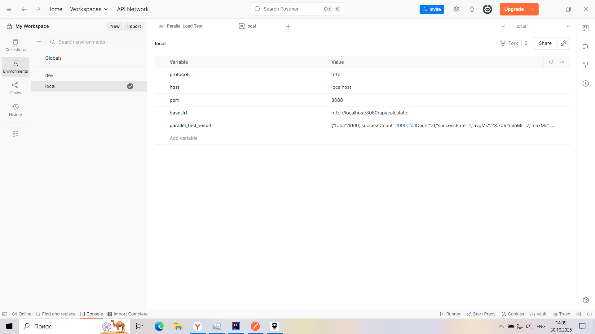
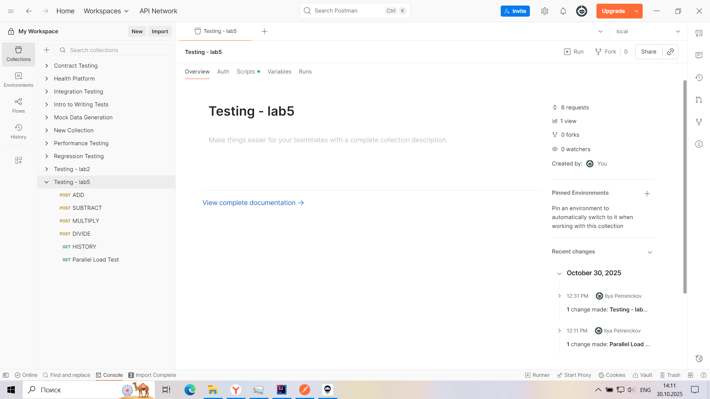
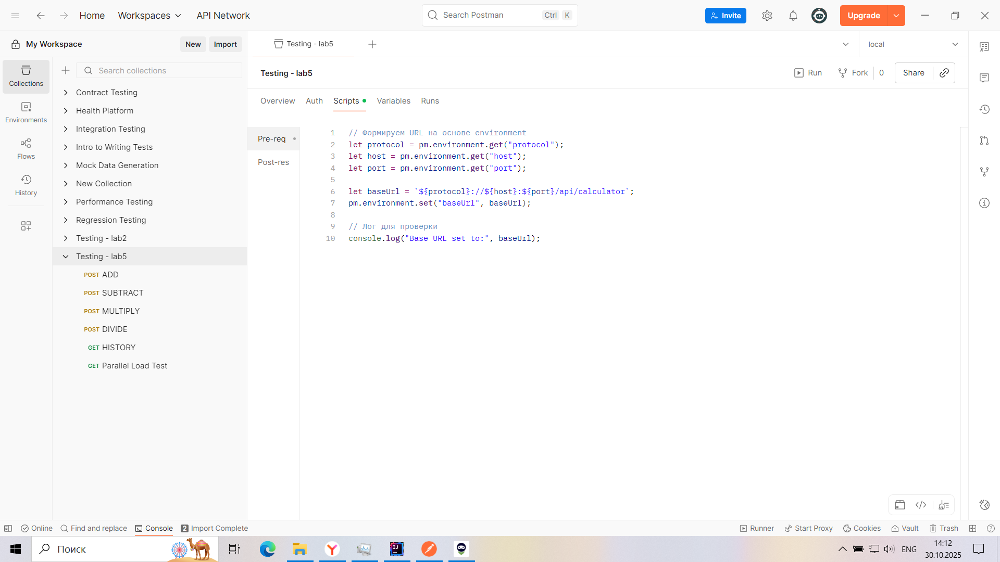
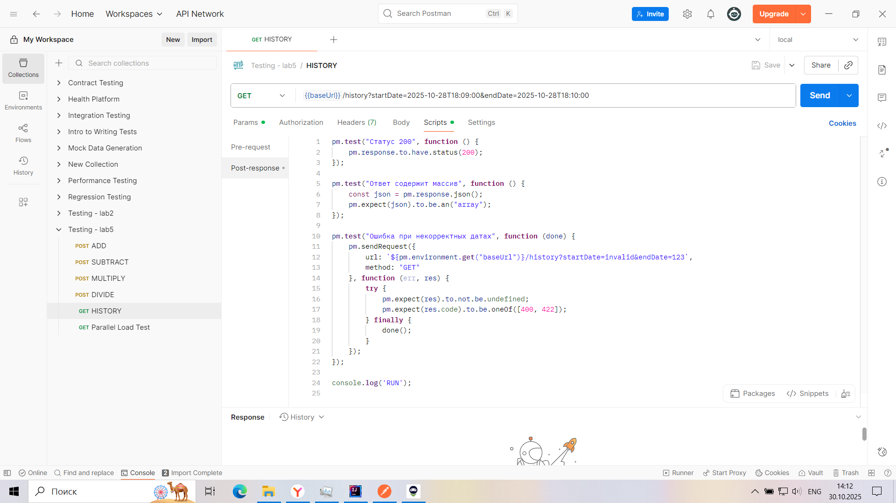
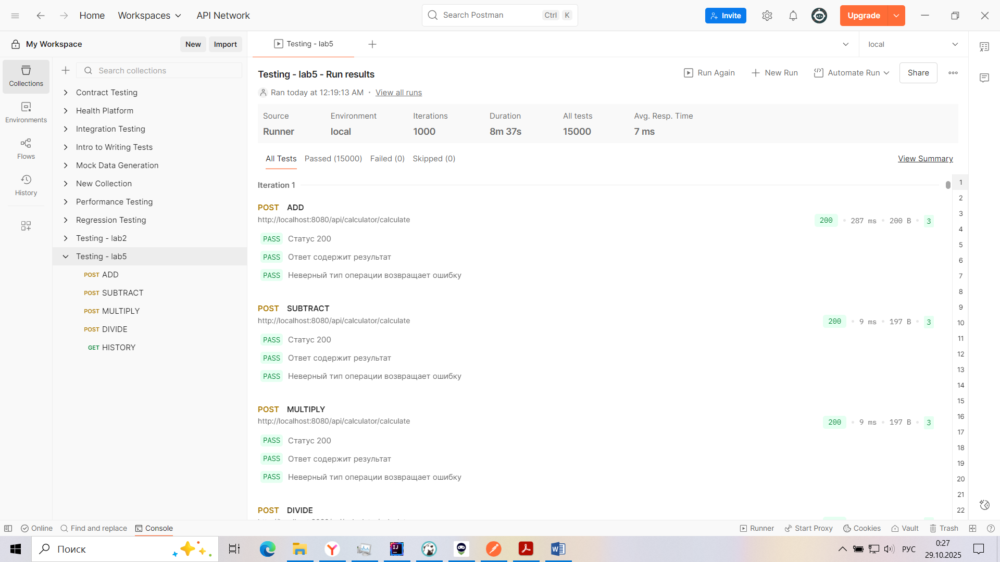
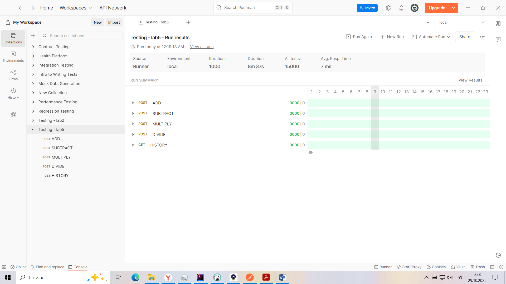
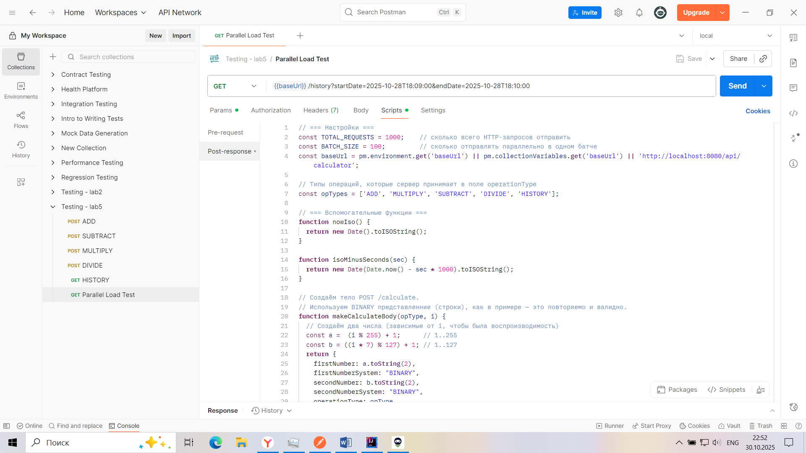
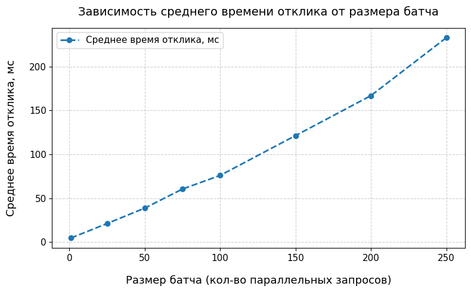

# Лабораторная работа 5 - Тестирование API
#### Выполнили: Янин Дмитрий, Петренков Илья, гр. 6231-020402D

## 📌 Цель работы
В процессе выполнения заданий познакомиться с возможностью автоматизированного тестирования API в **Postman**.

## ✨ Тестируемое приложение
**REST API** калькулятора для выполнения арифметических операций с
сохранением их в базу данных и получением истории по всем проведенным операциям.

### 🚀 Ключевые эндпоинты API

#### 🧮 `POST /api/calculator/calculate`
**Вычислительный маршрут** - выполняет комплексные арифметические операции между числами в различных системах счисления.

**Функциональность:**
- 🔢 **Поддержка multiple систем счисления**: *BINARY, DECIMAL, OCTAL, HEXADECIMAL*.
- ➕ **Арифметические операции**: *ADD, SUBTRACT, MULTIPLY, DIVIDE*.
- 💾 **Автоматическое сохранение** результатов в базе данных.
- 🔄 **Конвертация результатов** между системами счисления.
- ✅ **Валидация входных данных** и обработка ошибок.

**Пример запроса:**
```json
{
    "firstNumber": "110",
    "firstNumberSystem": "BINARY", 
    "secondNumber": "100",
    "secondNumberSystem": "BINARY",
    "operationType": "MULTIPLY"
}
```

#### 🧮 `GET /api/calculator/history`
Получение истории вычислений - предоставляет детализированную историю операций
с расширенными возможностями фильтрации.

**Возможности фильтрации:**
- 🎯 **По типу операции**: *operationType (ADD, SUBTRACT, MULTIPLY, DIVIDE)*.
- 🔢 **По системе счисления**: *firstNumberSystem, secondNumberSystem*.
- 📅 **По временным интервалам**: дата и время выполнения операции.
- 🎚️ **Комбинированные фильтры для точного поиска**.
- 📈 **Пагинация и сортировка результатов**.

## 🚀 Инструкция по запуску

### Предварительные требования
- Java 21 или выше
- Postman
- Maven 3.6+ (для сборки проекта)
- DBeaver или другой SQL-клиент (для управления БД)

### 1. Запуск сервера приложения

#### Сборка и запуск через Maven:
```bash
# Клонирование репозитория (если необходимо)
git clone <repository-url>
cd calculator-lab

# Сборка приложения
mvn clean package

# Запуск сервера
java -jar target/calculator-app-1.0.0.jar
```

#### Альтернативный запуск в IDE:
```bash
# Импортируйте проект как Maven проект в IntelliJ IDEA или Eclipse
# Найдите главный класс: CalculatorApplication.java
# Запустите метод main()
```

### 2. Запуск тестов через Postman

#### 🚀 Импорт коллекции и окружений
1. Откройте **Postman** → **Import → Files**.
2. Выберите:
    - `./postman/Testing - lab5.postman_collection.json` — коллекция запросов
    - `./postman/dev.postman_environment.json` и `./postman/local.postman_environment.json` — окружения
3. Убедитесь, что выбранное окружение активно и URL формируется через переменные.

---

#### 🔁 Последовательный запуск тестов
##### В Postman Runner
1. Откройте **Runner** (пункт “Run” в меню actions у коллекции).
2. Выберите:
    - Environment: `local` или `dev` (предпочтительно `local`)
    - Iterations: `1000`
3. Нажмите **Start Run** и дождитесь завершения.

##### Через Newman (CLI)
```bash
newman run Testing-lab5.postman_collection.json -e local.postman_environment.json --iteration-count 1000 -r cli,json --reporters-options "json.export=run-sequential.json"
```

#### ⚡ Параллельный запуск тестов
##### В Postman (через Promise.all)
1. Перейдите в коллекцию `Testing-lab5` и откройте запрос `Parallel Load Test`.
2. Нажмите кнопку `Send` для запуска параллельных тестов.
3. Отслеживайте статус выполнения тестов в **консоли** Postman.
4. Посмотрите результат в переменной окружения `parallel_test_result`.

##### Через Newman (CLI)
```bash
newman run Testing-lab5.postman_collection.json -n 1000 --parallel 10
```
## 🧪 Ход выполнения работы

### 1. Создание окружений (Environments)

Созданы два окружения: **local** и **dev**.  
В каждом заданы переменные:

| Переменная | Пример значения | Назначение |
|-------------|----------------|-------------|
| `protocol`  | `http`          | Протокол подключения |
| `host`      | `localhost`     | Хост сервера |
| `port`      | `8080`          | Порт сервера |
| `baseUrl`   | `auto`          | Формируется скриптом |

📸 **Скриншот:**

<div align="center">
  
  <br>
  <em>Рисунок 1 - Создание окружения </em>
</div>
<br/>

Пример содержимого `local.postman_environment.json`:
```json
{
  "name": "local",
  "values": [
    {"key":"protocol","value":"http"},
    {"key":"host","value":"localhost"},
    {"key":"port","value":"8080"},
    {"key":"baseUrl","value":""}
  ]
}
```

### 2. Создание коллекции и добавление запросов

Была создана коллекция **Testing – lab5**, в которую добавлены следующие запросы для проверки работы калькулятора:

| №  | Название запроса | Метод | Назначение |
|----|------------------|--------|-------------|
| 1  | **ADD**          | POST   | Получение результата сложения двух чисел |
| 2  | **SUBTRACT**     | POST   | Получение результата вычитания |
| 3  | **MULTIPLY**     | POST   | Получение результата умножения |
| 4  | **DIVIDE**       | POST   | Получение результата деления |
| 5  | **HISTORY**      | GET    | Получение истории всех вычислений за определённый период времени |


📸 **Скриншот интерфейса Postman с коллекцией:**

<div align="center">
  
  <br>
  <em>Рисунок 2 - Создание коллекции </em>
</div>

---

#### Пример запроса

**POST /calculate (ADD)**  
_Пример тела запроса:_
```json
{
    "firstNumber": "1010",
    "firstNumberSystem": "BINARY",
    "secondNumber": "110",
    "secondNumberSystem": "BINARY",
    "operationType": "ADD"
}
```

### 3. Настройка Pre-request Script для формирования URL

Для коллекции **Testing – lab5** был создан общий **Pre-request Script**,
который динамически формирует базовый URL (`baseUrl`)
на основе активного окружения (environment).

#### 🔧 Код скрипта:

```javascript
// Получаем переменные из активного окружения
const protocol = pm.environment.get("protocol") || "http";
const host = pm.environment.get("host") || "localhost";
const port = pm.environment.get("port") || "8080";

// Формируем базовый URL
const baseUrl = `${protocol}://${host}:${port}/api/calculator`;

// Сохраняем в переменные коллекции (доступно через {{baseUrl}})
pm.collectionVariables.set("baseUrl", baseUrl);

// Для отладки можно вывести результат в консоль Postman
console.log("Base URL:", baseUrl);
```

📸 **Скриншот примера настройки URL через переменную:**

<div align="center">
  
  <br>
  <em>Рисунок 3 - Динамическое создание переменной с URL </em>
</div>

---

### 4. Добавление тестов для каждого запроса (положительные и негативные случаи)

Для всех эндпоинтов коллекции были созданы **тесты в Postman**, проверяющие корректность ответа API.

---

#### ✅ Пример тестов для POST `/calculate` (операция сложения)

```javascript
// --- Положительный тест ---
pm.test("Статус 200", function () {
    pm.response.to.have.status(200);
});

pm.test("Ответ содержит поле result", function () {
    const json = pm.response.json();
    pm.expect(json).to.have.property("result");
});

// --- Негативный тест: неверный тип операции ---
pm.test("Некорректный тип операции возвращает ошибку", function () {
    pm.sendRequest({
        url: `${pm.collectionVariables.get("baseUrl")}/calculate`,
        method: "POST",
        header: {"Content-Type": "application/json"},
        body: {
            mode: "raw",
            raw: JSON.stringify({
                "firstNumber": "1010",
                "firstNumberSystem": "BINARY",
                "secondNumber": "110",
                "secondNumberSystem": "BINARY",
                "operationType": "INVALID"
            })
        }
    }, function (err, res) {
        pm.expect(res.code).to.equal(400);
    });
});
```

📸 **Скриншот вкладки Tests для POST-запроса:**

<div align="center">
  
  <br>
  <em>Рисунок 4 - Добавление тестов </em>
</div>

---

### 5. Последовательный запуск тестов (последовательное выполнение 1000 итераций)

Для оценки стабильности работы сервера было проведено тестирование приложения
в **Postman Runner** с последовательным запуском **1000 итераций** коллекции.

---

#### ⚙️ Настройка Runner

- Коллекция: `Testing – lab5.postman_collection.json`
- Environment: `local`
- Iterations: `1000`
- Delay: `0 ms`
- Execution Mode: **Run manually** (последовательный запуск)

---

#### 📈 Результаты теста

- Всего выполнено: **1000 запросов**
- Среднее время отклика: **≈ 7 мс**
- Ошибок: **0**
- Все тесты прошли успешно ✅

📸 **Скриншот результатов выполнения итераций:**
<div align="center">
  
  <br>
  <em>Рисунок 5 - Результат выполнения итераций </em>
</div>
<br/>

<div align="center">
  
  <br>
  <em>Рисунок 6 - Отчет о запуске 1000 итераций</em>
</div>
<br/>

---

#### 💬 Комментарий к результатам

Сервер справился с нагрузкой **уверенно**, без ошибок и с минимальным временем отклика.  
Так как тест выполнялся **локально**, низкое среднее время (около 7 мс) объясняется
отсутствием сетевой задержки и малым объёмом обрабатываемых данных, также возможно
применение кэширования Postman.

> ✅ Вывод: сервер стабильно обрабатывает серию последовательных запросов, проблемы с
производительностью отсутствуют.

### 6. Реализация параллельного запуска тестов и сравнение результатов

Для имитации **массовой параллельной нагрузки** на сервер был реализован
скрипт `Parallel Load Test`, выполняющий **1000 запросов** с делением на батчи по `BATCH_SIZE`.  
Такой подход позволяет гибко контролировать количество параллельных запросов и предотвращает перегрузку клиента.

📸 **Скриншот с кодом созданного скрипта:**
<div align="center">
  
  <br>
  <em>Рисунок 7 - Скрипт для параллельных запросов </em>
</div>
<br/>

#### 📊 Анализ производительности при параллельном запуске

После проведения серии нагрузочных экспериментов с различным размером батча (`BATCH_SIZE`)
были собраны метрики времени отклика и общего времени выполнения тестов.  
Все тесты выполнялись на локальном сервере (`localhost:8080`) при одинаковых условиях.

---

##### 📈 Таблица результатов

| Размер батча | Количество запросов | Среднее время отклика (мс) | Ошибок |
|--------------|---------------------|----------------------------|--------|
| 1            | 1000                | 4,70                       | 0      |
| 25           | 1000                | 21,17                      | 0      |
| 50           | 1000                | 38,76                      | 0      |
| 75           | 1000                | 60,46                      | 0      |
| 100          | 1000                | 76,00                      | 0      |
| 150          | 1000                | 121,34                     | 0      |
| 200          | 1000                | 166,82                     | 0      |
| 250          | 1000                | 232,79                     | 0      |

<br/>

📸 **Скриншот запуска параллельных тестов в Postman:**
<div align="center">
  
  <br>
  <em>Рисунок 8 - Запуск параллельных тестов в Postman</em>
</div>
<br/>

---

##### 📊 График зависимости среднего времени отклика от размера батча

<div align="center">
  
  <br>
  <em>Рисунок 8 - Запуск параллельных тестов в Postman</em>
</div>

_(на графике видно линейное увеличение среднего времени отклика при увеличении размера батча)_

---

#### 💬 Комментарии к результатам

- При **последовательной отправке (по одному запросу)** сервер демонстрирует минимальную задержку —  
  среднее время отклика составляет **около 4,7 мс**.
- С увеличением размера параллельно выполняющихся запросов (до **25–75**) время отклика **растёт пропорционально**,  
  так как сервер начинает обрабатывать больше запросов одновременно.
- При **BATCH_SIZE = 100–150** видно **заметное увеличение средней задержки** — до **121 мс**,  
  что указывает на начало насыщения серверных ресурсов.
- При **BATCH_SIZE > 200** также наблюдается **линейный рост времени отклика**,  
  что свидетельствует о том, что сервер постепенно достигает предела параллельной обработки.
- Во всех тестах **ошибок не возникло**, что говорит о стабильной работе API даже под высокой нагрузкой.

---

#### ✅ Выводы

- В ходе выполнения лабораторной работы были успешно реализованы:
   - создание **двух окружений (local и dev)** с переменными `protocol`, `host`, `port`, `baseUrl`;
   - написание **pre-request script**, формирующего динамический URL на основе активного окружения;
   - разработка **коллекции запросов** для всех ключевых эндпоинтов сервиса (`/calculate`, `/history`);
   - добавление **позитивных и негативных тестов** для проверки корректности ответов сервера;
   - проведение **API-тестирования** с последовательной и параллельной отправкой запросов.

- Сервер продемонстрировал **высокую стабильность и отказоустойчивость** при отправкее 1000 последовательных запросов.  
  Все тесты завершились успешно, ошибок не зафиксировано.

- При **увеличении степени параллельности** (размер батча) наблюдается закономерный рост среднего времени отклика,  
  что указывает на достижение системных ограничений по ресурсам, но без полного отказа приложения.

- Оптимальный диапазон параллельных запросов — **25–75**, при котором достигается **наилучший баланс** между  
  скоростью выполнения и устойчивостью работы сервера.

- Результаты тестов подтвердили, что разработанный API:
   - корректно обрабатывает массовые запросы;
   - устойчив к перегрузкам;
   - демонстрирует линейную масштабируемость до разумных пределов параллельности.

> 💡 **Итог:** цели лабораторной работы достигнуты, методика тестирования отработана.
